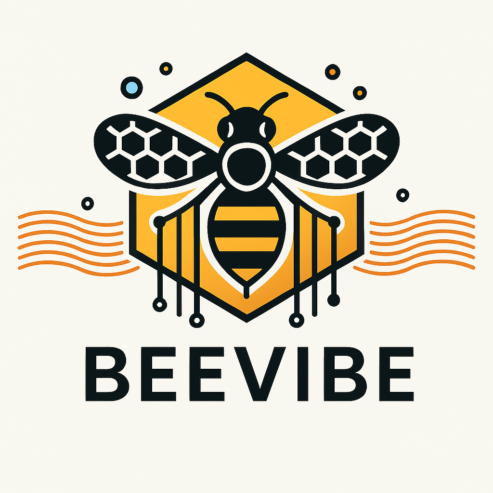

# 🐝 Beevibe

### **Feel the vibe of building smarter models.**

**Current Version: 0.1**

---

## 🐝 **About Beevibe**
Beevibe is a Python package designed to make it easier to train advanced language models on text datasets with specific themes and perform accurate inference on new sentences. Beevibe is built to empower developers and researchers with tools that are efficient, intuitive, and scalable.

Beevibe leverages modern features to simplify workflows and enhance user experience. 

---

## ✨ **Features**

It integrates:

- **Simplified Usage**: Designed for simplicity and efficiency, making it lightweight and easy to use.
- **Powered Functionalities**:
  - Energy-efficient training using QLoRA.
  - Seamless creation of classification heads.
  - High-level functions to manage holdout and cross-validation.
- **Tutorial-Ready**: 
  - Comes with synthetic datasets for Elegana Customer Relationship Management 
  - Covering binary, multi-class, and multi-label classification.
  - Comprehensive tutorials for CamemBERT, CamemBERTV2, and ModernBERT, 
- **Streamlined Development**:
  - Supports GitHub Codespaces and VSCode for development.
  - Colab integration for GPU testing.
- **Quality Assurance**:
  - Implements `ruff` for code linting and `pydantic` for parameter validation.
  - Comprehensive test suite for non-regression verification.

---

## 📦 **Installation**

Install Beevibe using pip:

```bash
pip install Beevibe
```

---

## 🚀 **Quickstart**

### **1. Training a Model**
Train CamemBERT on your custom thematic dataset:

```python
from Beevibe import BeeCustomMaskModelForClassification, BeeTrainer

# Define classification head
head_layer_configs = [
        {"input_size": 768, "output_size": num_classes, "activation": None},
    ]

# Initialize model
bv_model = BeeCustomMaskModelForClassification(
    model_name = "camembert-base",
    num_labels = 5,
    layer_configs=head_layer_configs
)

# Initialize the trainer
trainer = BeeTrainer(model=bv_model)

# Train the model
ret = trainer.train(texts=texts, labels=labels, num_epochs=1)

# Save the trained model
trainer.save_model("./sav_model")

# Free CPU/GPU memory
trainer.release_model()

```

### **2. Performing Inference**
Use the trained model to classify or extract themes from new sentences:

```python
from Beevibe import BeeCustomMaskModelForClassification

# Load the trained model
bv_model = BeeCustomMaskModelForClassification.load_model_safetensors("./sav_model")

# Infer themes for a new sentence
result = bv_model.predict(["This is a new sentence to classify."])

print("Predicted Theme:", result)
```

---

## 📜 **License**

Beevibe is licensed under the MIT License. See the [LICENSE](LICENSE) file for details.

---

## 📖 **Citing Beevibe**

If you use Beevibe in your research, projects, or publications, please cite it as follows:

```
@misc{Beevibe2024,
  title={Beevibe: Feel the vibe of building smarter models},
  author={François Bullier},
  year={2024},
  url={https://github.com/fbullier/Beevibe},
  note={Version 0.1}
}
```

By citing Beevibe, you help others discover and build upon this work!

---

## 🌟 **Acknowledgments**
- Created with the assistance of AI tools like ChatGPT.
- Inspired by the brilliance of **BERT** and the power of Python.
- Special thanks to the vibrant community of developers and data scientists who make innovation possible.

---


